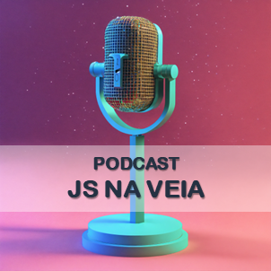

<p align="center">
    
</p>

<p align="center">
<a href="https://dio.me/">
    
</a>
<a href="https://dio.me/">
    
</a>
</p>

-------

<p align="center">
    
</p>

<p align="center">
    Preview do podcast
</p>

<div align="center">
    <audio src="https://github.com/gabrielbuenosilva/prompts-for-podcast-generate-by-ia/raw/main/output/output-edited.MP3" controls title="Podcast editado"></audio>
</div>

# Projeto Podcast Gerado por I.A.s

> ℹ️ **NOTE:** Este repositório foi desenvolvido como parte da trilha de Fundamentos de IA para Devs do Santander Bootcamp 2024.

Projeto com o objetivo de gerar um podcast utilizando ferramentas de IA através de prompts mais trabalhados.

## 💻 Tecnologias utilizadas no projeto

- [Capcut](https://www.capcut.com/pt-br/) - para editar o áudio
- [ChatGPT](https://chat.openai.com/) - para gerar título e conteúdo
- [ElevenLabs](https://beta.elevenlabs.io/) - para gerar a narração
- [Lexica.art](https://lexica.art/) - para gerar imagens
- [PowerPoint](https://www.microsoft.com/en/microsoft-365/powerpoint) - para formatação do banner

## 📄 Prompts e ferramentas

### ChatGPT：

| Ação           | Prompt                                                                                                                                                                                                                                                                                                 |
|----------------|--------------------------------------------------------------------------------------------------------------------------------------------------------------------------------------------------------------------------------------------------------------------------------------------------------|
| Criar Título   | ``` Você é o roteirista de um podcast de tecnologia focado em JavaScript frontend e backend. Seu público será jovens DEVs Jr. brasileiros. O podcast tem caráter informativo e linguagem jovem e levemente informal. Me dê 10 sugestões de nomes para este podcast. {Regras} > Curto > Nerd > Divertido > Trazendo um trocadilho nerd, de TI ou JS {Regras Negativas} > Não deve fazer referência explícita ou implícita ao Brasil ou brasileiros > Não deve fazer referência a nenhum framework JS ``` |
| Criar Conteúdo | ``` Você é o roteirista de um podcast chamado "JS na Veia". O podcast tem caráter informativo e linguagem jovem e levemente informal. O podcast é focado no público jovem iniciante em JS backend e frontend. Crie um roteiro seguindo os seguintes blocos de conteúdo: [APRESENTAÇÃO] [CURIOSIDADE BACKEND JS] [CURIOSIDADE FRONTEND JS] [FINALIZAÇÃO/DESPEDIDA] O nome do apresentador deverá ser Gabriel. ```                                                                                                               |

### lexica.art:

| Ação                  | Palavra Chave       |
|-----------------------|---------------------|
| Buscar Imagem Gerada por IA | Podcast Red |

## 🛠️ Instruções de execução

Utilize os prompts propostos acima nas ferramentas sugeridas, revise o conteúdo gerado e use o ElevenLabs para criar a narração e o PowerPoint para editar o banner.